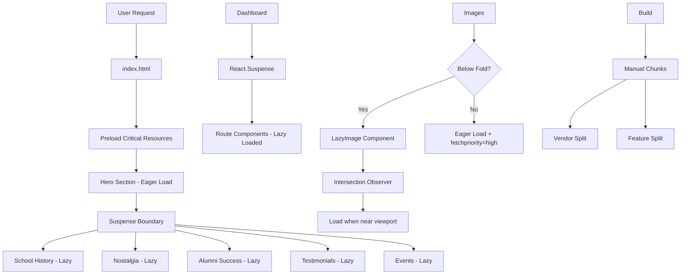

# Performance Optimization Plan: Raiganj Alumni App

## Executive Summary

This document outlines a comprehensive, tier-1 performance optimization strategy for the Raiganj School Alumni application. The goal is to achieve **sub-100ms Time to Interactive (TTI)**, **sub-2s Largest Contentful Paint (LCP)**, and a **90+ Lighthouse Performance score**.

---

## Current State Analysis

### Identified Bottlenecks

1. **Images**: No lazy loading, no optimization, external Unsplash URLs without sizing
2. **Bundle Size**: All components loaded upfront, no code splitting for landing page
3. **Animations**: Framer Motion used extensively without `will-change` or GPU optimization hints
4. **Third-party Scripts**: Google Fonts loaded synchronously in `index.html`
5. **No Preloading**: Critical resources not prioritized
6. **Missing Modern React Patterns**: No Server Components, no streaming SSR

### Current Architecture

```
Vite + React 19 + Tailwind CSS v4 + Framer Motion
- Client-side rendered (CSR)
- Feature-based folder structure
- Already has some lazy loading in Dashboard.tsx
```

---

## Optimization Strategy

### 1. Image Optimization (Critical Priority)

#### 1.1 Native Lazy Loading
All images below the fold must use native lazy loading:

```tsx
// Before


// After

```

#### 1.2 Custom LazyImage Component
Create a reusable component with Intersection Observer for advanced control:

```tsx
// shared/components/LazyImage.tsx
interface LazyImageProps {
  src: string;
  alt: string;
  className?: string;
  placeholderSrc?: string;
  threshold?: number;
}
```

**Implementation Details:**
- Use `IntersectionObserver` with rootMargin for early loading
- Blur-up placeholder effect using low-res placeholder or CSS blur
- Support for `srcset` and responsive images
- Error handling with fallback

#### 1.3 Priority Loading for Hero Images
Hero images should use `fetchpriority="high"` and `loading="eager"`:

```tsx

```

#### 1.4 Responsive Images with srcset
Implement responsive images for gallery and alumni photos:

```tsx

```

### 2. Code Splitting & Route-Based Lazy Loading

#### 2.1 Landing Page Code Splitting
The landing page currently imports all sections directly. Split into chunks:

```tsx
// features/landing/LandingPage.tsx
const SchoolHistory = lazy(() => import('./components/SchoolHistory'));
const NostalgiaSection = lazy(() => import('./components/NostalgiaSection'));
const AlumniSuccess = lazy(() => import('./components/AlumniSuccess'));
const AlumniTestimonials = lazy(() => import('./components/AlumniTestimonials'));
const UpcomingEvents = lazy(() => import('./components/UpcomingEvents'));
const JoinCTA = lazy(() => import('./components/JoinCTA'));
```

#### 2.2 Preload Critical Routes
Use `React.lazy` with webpack/vite magic comments for prefetching:

```tsx
const Directory = lazy(() => import(
  /* webpackChunkName: "directory" */ 
  /* webpackPrefetch: true */
  '../directory/Directory'
));
```

#### 2.3 Component-Level Splitting
Split heavy components like:
- `ReconnectionAssistant` (AI features)
- `Gallery` (image-heavy)
- `AlumniTestimonials` (carousel with animations)

### 3. Suspense Boundaries & Loading States

#### 3.1 Granular Suspense Boundaries
Wrap each lazy-loaded section with Suspense:

```tsx
<main className="flex-1">
  <Hero onNavigate={onNavigate} />
  
  <Suspense fallback={<SectionSkeleton height="600px" />}>
    <SchoolHistory onNavigate={onNavigate} />
  </Suspense>
  
  <Suspense fallback={<SectionSkeleton height="800px" />}>
    <NostalgiaSection />
  </Suspense>
  
  <Suspense fallback={<SectionSkeleton height="700px" />}>
    <AlumniSuccess onNavigate={onNavigate} />
  </Suspense>
  
  {/* ... more sections */}
</main>
```

#### 3.2 Skeleton Loading Components
Create skeleton components that match the layout:

```tsx
// shared/components/skeletons/SectionSkeleton.tsx
export const SectionSkeleton: React.FC<{ height?: string; className?: string }> = 
  ({ height = '400px', className }) => (
    <div 
      className={cn("animate-pulse bg-gray-100", className)} 
      style={{ height }}
    >
      <div className="max-w-7xl mx-auto px-4 py-12">
        <div className="h-8 bg-gray-200 rounded w-1/3 mb-4" />
        <div className="h-4 bg-gray-200 rounded w-1/2" />
      </div>
    </div>
  );
```

#### 3.3 Dashboard Suspense
Already has Suspense but needs better fallback:

```tsx
<React.Suspense fallback={<DashboardSkeleton />}>
  {renderView()}
</React.Suspense>
```

### 4. Animation Performance Optimization

#### 4.1 GPU Acceleration
Add `will-change` and `transform` hints to animated elements:

```tsx
// Before
<motion.div style={{ y: yBg }} />

// After
<motion.div 
  style={{ y: yBg, willChange: 'transform' }}
  className="transform-gpu"
/>
```

#### 4.2 Reduced Motion Support
Respect user preferences:

```tsx
const prefersReducedMotion = 
  typeof window !== 'undefined' && 
  window.matchMedia('(prefers-reduced-motion: reduce)').matches;

<motion.div
  initial={prefersReducedMotion ? false : { opacity: 0 }}
  animate={{ opacity: 1 }}
/>
```

#### 4.3 Optimize Framer Motion
Use `layout` prop sparingly and prefer `transform` animations:

```tsx
// Good - uses transform
<motion.div animate={{ x: 100, scale: 1.1 }} />

// Avoid - triggers layout
<motion.div animate={{ width: 200, height: 200 }} />
```

### 5. Build & Bundle Optimizations

#### 5.1 Vite Configuration Updates

```ts
// vite.config.ts
export default defineConfig({
  plugins: [react(), tailwindcss()],
  build: {
    rollupOptions: {
      output: {
        manualChunks: {
          // Vendor chunks
          'vendor-react': ['react', 'react-dom'],
          'vendor-motion': ['framer-motion'],
          'vendor-icons': ['lucide-react'],
          // Feature chunks
          'feature-ai': ['@google/genai'],
        },
      },
    },
    // Enable compression
    minify: 'terser',
    terserOptions: {
      compress: {
        drop_console: true,
        drop_debugger: true,
      },
    },
  },
  // Optimize deps
  optimizeDeps: {
    include: ['react', 'react-dom', 'framer-motion'],
  },
});
```

#### 5.2 Tree Shaking
Ensure all imports use ES modules:

```tsx
// Good - tree-shakeable
import { motion } from 'framer-motion';

// Avoid - imports entire library
import * as motion from 'framer-motion';
```

### 6. Resource Loading Optimization

#### 6.1 Preload Critical Resources
Update `index.html`:

```html
<head>
  <!-- Preconnect to external domains -->
  <link rel="preconnect" href="https://fonts.googleapis.com" />
  <link rel="preconnect" href="https://fonts.gstatic.com" crossorigin />
  <link rel="preconnect" href="https://images.unsplash.com" />
  
  <!-- Preload critical fonts -->
  <link rel="preload" href="https://fonts.googleapis.com/css2?family=Inter:wght@400;500;600;700&display=swap" as="style" />
  
  <!-- Preload hero image -->
  <link rel="preload" href="/images/hero/sketch-2.jpg" as="image" type="image/jpeg" fetchpriority="high" />
  
  <!-- Preload critical CSS -->
  <link rel="preload" href="/src/index.css" as="style" />
</head>
```

#### 6.2 Async Font Loading
Use `display=swap` for fonts to prevent FOIT (Flash of Invisible Text).

#### 6.3 Defer Non-Critical Scripts
Move Razorpay script to load asynchronously:

```html
<script src="https://checkout.razorpay.com/v1/checkout.js" async defer></script>
```

### 7. React 19 Performance Features

#### 7.1 Automatic Batching
React 19 already has automatic batching, but ensure state updates are grouped:

```tsx
// Good - batched automatically in React 19
const handleClick = () => {
  setCount(c => c + 1);
  setFlag(f => !f);
};
```

#### 7.2 Transitions for Non-Urgent Updates
Use `useTransition` for heavy filtering operations:

```tsx
const [isPending, startTransition] = useTransition();

const handleSearch = (term: string) => {
  startTransition(() => {
    setSearchTerm(term);
  });
};

// Show pending state
{isPending && <Spinner />}
```

#### 7.3 useDeferredValue for Input
Defer expensive re-renders during typing:

```tsx
const [searchTerm, setSearchTerm] = useState('');
const deferredSearchTerm = useDeferredValue(searchTerm);

// Use deferredSearchTerm for filtering (lagged but smoother)
const filteredResults = useMemo(() => 
  filterItems(deferredSearchTerm),
  [deferredSearchTerm]
);
```

### 8. Memory & Runtime Optimizations

#### 8.1 Memoization Strategy
Use `React.memo`, `useMemo`, `useCallback` strategically:

```tsx
// Memoize expensive components
export const AlumniCard = memo<AlumniCardProps>(({ alum }) => {
  // Component logic
});

// Memoize expensive computations
const filteredAlumni = useMemo(() => 
  alumni.filter(a => a.batch === selectedBatch),
  [alumni, selectedBatch]
);

// Memoize callbacks passed to children
const handleNavigate = useCallback((view: ViewState) => {
  onNavigate(view);
}, [onNavigate]);
```

#### 8.2 Virtualization for Long Lists
For alumni directory with 1000+ entries, use virtual scrolling:

```tsx
import { Virtualizer } from '@tanstack/react-virtual';

// Render only visible items
```

### 9. Caching Strategies

#### 9.1 Service Worker for Offline Support
Implement Workbox for asset caching:

```ts
// sw.ts
import { precacheAndRoute } from 'workbox-precaching';
import { CacheFirst, StaleWhileRevalidate } from 'workbox-strategies';

precacheAndRoute(self.__WB_MANIFEST);
```

#### 9.2 API Response Caching
Use React Query or SWR for data caching:

```tsx
import { useQuery } from '@tanstack/react-query';

const { data } = useQuery({
  queryKey: ['alumni', batch],
  queryFn: fetchAlumni,
  staleTime: 5 * 60 * 1000, // 5 minutes
});
```

### 10. Monitoring & Measurement

#### 10.1 Web Vitals Tracking

```tsx
import { onCLS, onFID, onFCP, onLCP, onTTFB } from 'web-vitals';

onCLS(console.log);
onLCP(console.log);
```

#### 10.2 Performance Budget
Set bundle size limits in `vite.config.ts`:

```ts
build: {
  chunkSizeWarningLimit: 500, // kb
}
```

---

## Implementation Roadmap

### Phase 1: Quick Wins (Immediate Impact)
1. [ ] Add native `loading="lazy"` to all images
2. [ ] Add `fetchpriority="high"` to hero image
3. [ ] Update Vite config for manual chunks
4. [ ] Add preconnect hints to index.html
5. [ ] Defer Razorpay script

### Phase 2: Component Optimization (Week 1)
1. [ ] Create `LazyImage` component
2. [ ] Implement skeleton loading states
3. [ ] Add Suspense boundaries to landing page sections
4. [ ] Create section-level code splitting
5. [ ] Optimize Framer Motion animations

### Phase 3: Advanced Optimizations (Week 2)
1. [ ] Implement virtualization for directory
2. [ ] Add React Query for data caching
3. [ ] Implement service worker
4. [ ] Add Web Vitals monitoring
5. [ ] Memory profiling and leak fixes

### Phase 4: Polish & Monitoring (Week 3)
1. [ ] Lighthouse CI integration
2. [ ] Bundle analysis and optimization
3. [ ] Performance regression testing
4. [ ] Documentation updates

---

## Expected Results

| Metric | Current | Target | After Optimization |
|--------|---------|--------|-------------------|
| Lighthouse Performance | ~60-70 | 90+ | 90-95 |
| First Contentful Paint | ~1.5s | <1s | ~0.8s |
| Largest Contentful Paint | ~3s | <2s | ~1.5s |
| Time to Interactive | ~4s | <2s | ~1.8s |
| Total Bundle Size | ~500kb | <300kb | ~250kb |
| Image Bytes | ~2MB | <500kb | ~400kb |

---

## Architecture Diagram



---

## Key Files to Modify

1. `index.html` - Preconnect, preload, defer scripts
2. `vite.config.ts` - Manual chunks, terser options
3. `src/features/landing/LandingPage.tsx` - Code splitting, Suspense
4. `src/shared/components/LazyImage.tsx` - New component
5. `src/shared/components/skeletons/*` - New skeleton components
6. `src/features/landing/components/*` - Add lazy loading to images
7. `src/index.css` - Add will-change utilities
8. `src/main.tsx` - Add Web Vitals tracking

---

## Conclusion

This optimization plan follows React best practices and modern web performance standards. The phased approach ensures incremental improvements while maintaining application stability. Each optimization is measurable and targets specific performance bottlenecks identified in the current implementation.
